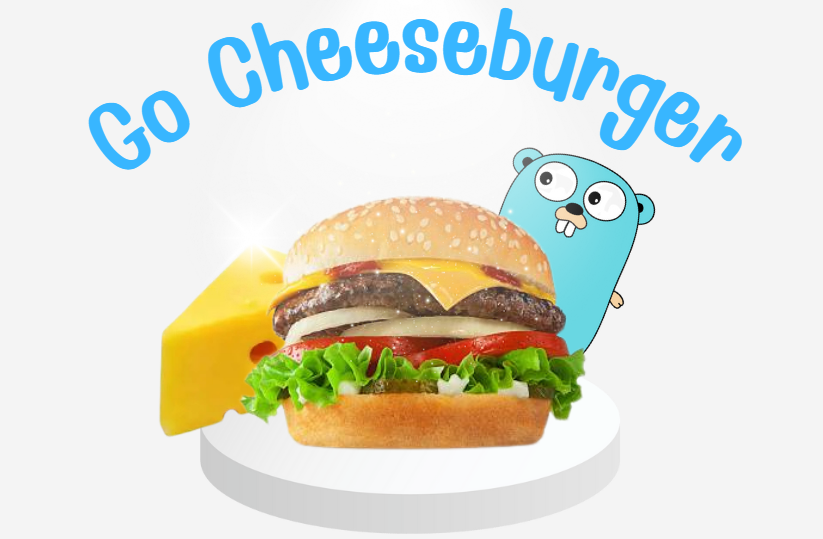

# GoCheeseburger - Practicing Go API using Hexagonal Architecture

## **As you can see this is connected to sqlite database that has a lot of cheeses**

## **What is Hexagonal Architecture**
#### It is an architecture that consists of 3 main parts

- **Handler**: Takes requests from the user and provides a response. It sends the request to the service layer.
- **Service**: This is where the logic of the application takes place. The service communicates with the repository layer to interact with the database.
- **Repository**: This layer interacts with the database, ensuring the core business logic remains decoupled from the data access details.

#### You can git clone this project then run the following commands:

- `go mod init [your folder name]`
- `go mod tidy` (To get all dependencies that you might have added)
- `go build`
